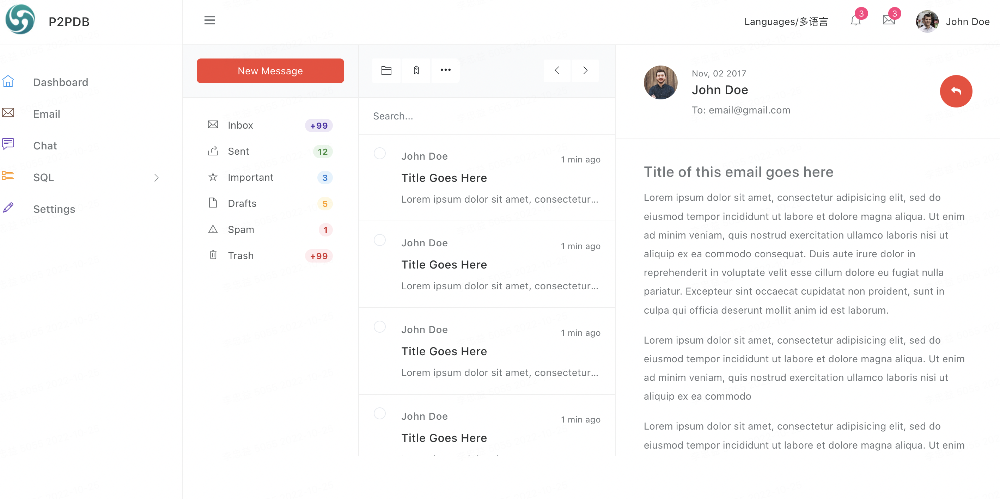

### 需求分析
在Web2.0 时代中，邮件系统通常是由某大型公司提供并做数据交换，通常会通过一个中心节点交换数据，而邮件的内容其实对于该公司来说是透明的，不适合发送较为隐私的个人邮件，而基于P2PDB开发的邮件系统，邮件内容通过隐私加密，并且直达对等节点，无需中心节点做数据交换，P2PDB基于libp2p实现的gossip 流言广播算法，可以保证数据传播的到达的可靠性。

### 实现功能


### 最小核心实现
1、实现邮件的点对点发送

2、实现邮件的群组广播发送


### 实现过程
1、使用Adminator Bootstrap 5 Admin Template 实现前端界面
[模版地址](https://github.com/puikinsh/Adminator-admin-dashboard )
感谢Aigars Silkalns 为开源贡献如此简洁及好用的模版

2、使用p2pdb 作为数据库的存储及数据广播的实现

3、使用go 语言中的beego框架的orm 连接p2pdb [其它语言的连接参考](zh-cn/application/connection_clinets.md)

* config 目录的app.conf 文件添加mysql 链接配置

```json
sqlconn = root:@tcp(127.0.0.1:3306)/p2pdb
```


4、对接p2pdb 提供的websocket 实现消息的及时通知 

### 结论

### 法律声明
以上技术实现仅仅是理论上的，如需要具体实现需要咨询并遵守当地国家的法律法规，切勿使用P2PDB应用在违反当地法律的产品中，由此产生的法律问题，均由使用者承担，P2PDB团队不承担任何法律责任。
