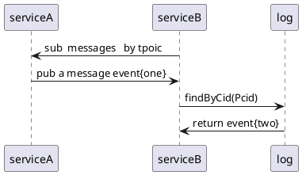
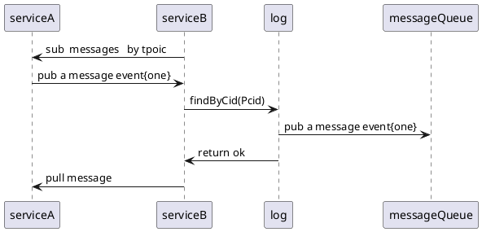
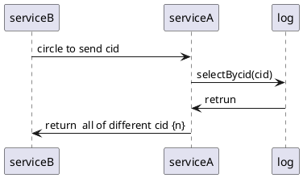

# p2pdb-log 详细开发设计

## merkle-dag 
注意新插入的节点在有向无环图的最上面，root根节点cid是子节点的cid的mergeHash(cid_one,cid_two)，root根的pcid 可能来源子节点的任意一个cid,详细数据结构可见实体图。

- function
    - findByCid //根据Id 查找节点位置及对应操作事件数据
    - findHByPcid //根据父hash 查找子节点位置及对应操作事件数据
    - selectBycid //根据cid 查找所有该cid上的节点
    - insertAccordingToPCid //插入一条数据到pcid 上面
    - updateByCid
    - deleteByCid
    - compare  //比较两个dag 的差异,并返回差异集
    - merge  //合并两个dag
    - pull  
    - push 

### 写入事件规律
1、merkle-dag 每个节点代表一个事件,节点id  是一个根据子节点hash merge 计算的唯一hash值
2、每写入一个新事件，作为一个新的根
3、每写入一个旧事件，会引起上层所有节点重新计算hash值，直到根节点

### 推送动作
服务器A发生一个事件two给服务器B,存在两种情况
1、在服务器B中根据事件a的Pcid 查找到对应的事件one,查找成功,将事件two作为新事件插入到事件one上面

2、在服务器B中根据事件a的Pcid 无法查找到对应的节点，此时触发拉取动作,并且停止新请求写入,将新请求消息存放到临时队列中

### 拉取动作
服务器B将根节点cid(可能是批量) 发送给服务器A，服务器A收取到后，进行查找匹配到最近的一个cid,并将上层所有的cid 压缩返回给服务器B

### 合并契机
服务器A作为发送节点会成为差异节点，将差异cid 发生给服务器B, 服务器B根据差异CID合并，并将对比后正确的差异事件发送给服务器A

### 并发事件
如论文所说，当一个pcid 出现两个相同的cid， merkle-dag 无法说出谁先谁后, p2pdb-log不会直接做排序，而是把对应的排序交由上层的consistency模块实现，具体参考consistency模块

### 具体实现的内容
1、对ipfs merkle-dag 做了一层封装
2、提供一些基本的接口供上层的一致性模块调用

### 解决冲突方式
1、同步合并DAG
当两个DAG产生冲突时，本地会根据接收的DAG事件自行调用consistency模块实现进行冲突解决,该方法效率快，速度快
2、异步合并DAG
虽然同步合并DAG拥有很好的效率，但是我们不能保证在网络不稳定、延迟严重的情况下,事件不丢，后台会记录对等节点，
定时跟对等节点对比一次DAG,如果出现差异，两个对等节点进行DAG的合并，直到完全一致性
3、异步合并后，已经订阅过的事件如何处理
异步合并DAG的时机，应该跟生成快照的时机完全一致，当两个节点完成DAG合并后，会生成一份快照，同样用户可以根据上一份快照
结果集，按照DAG顺序回放执行，并将新的结果集替换旧的结果集，同时生成一份新的快照，以供下次异步合并，异步合并的时机不应该
太过于频繁，我们建议一天合并一次。