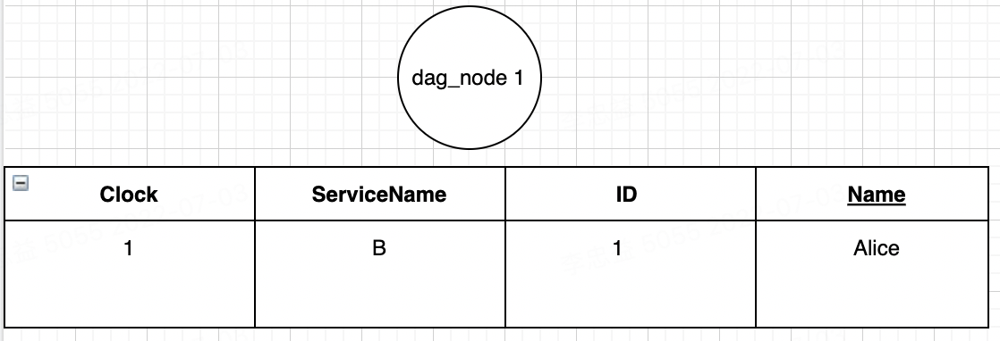
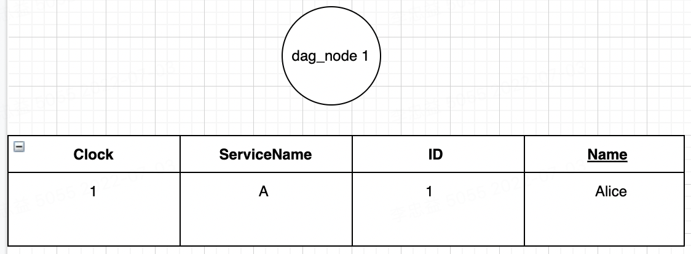
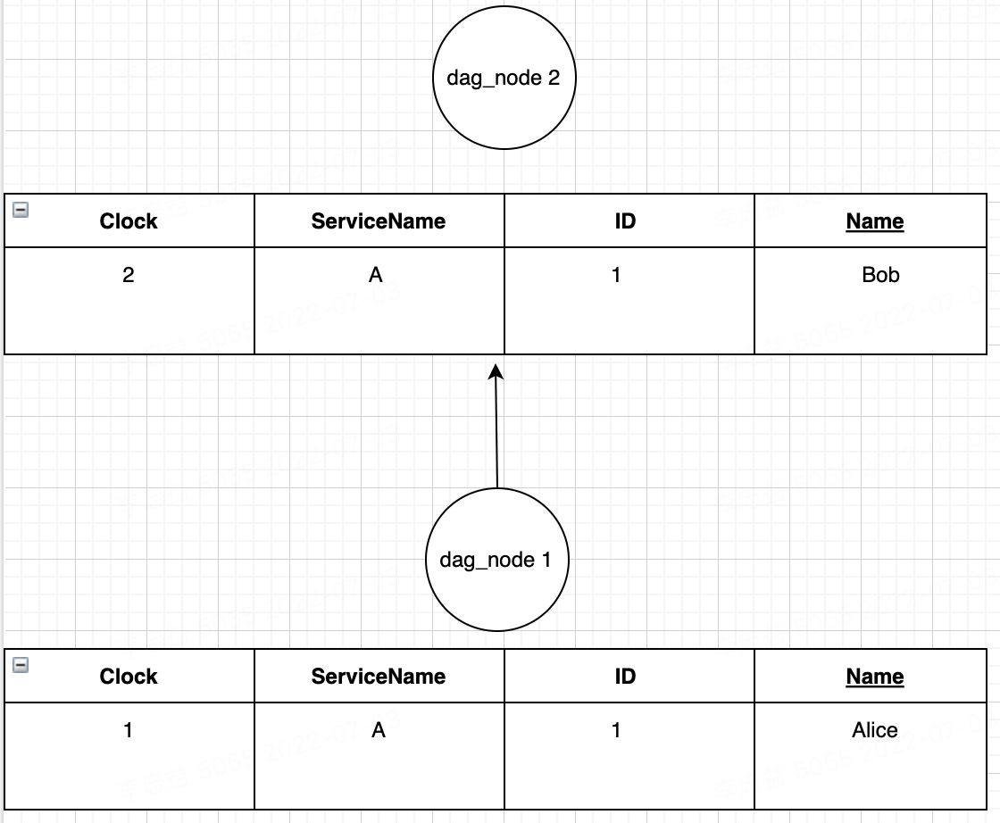
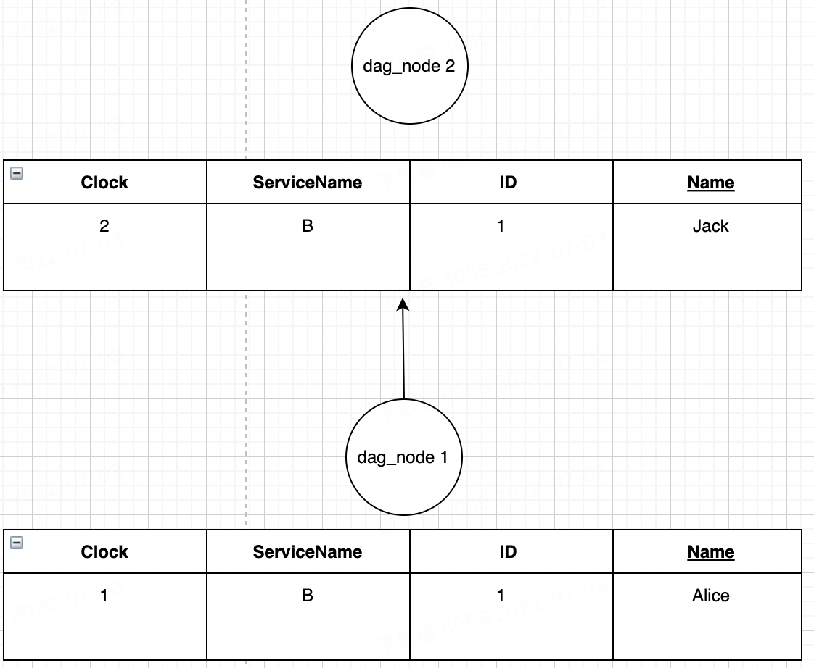

## merkle-dag   实现

### 场景一 两个服务并发更新同一条数据
#### 一、准备测试场景
1、准备一条数据,每个服务对于每张表都会保存一张完整DAG图
```
insert into table(id,name) values(1,"Alice")
```
2、服务A初始化DAG图



3、服务B初始化DAG图


解释：
此时可以看到服务A跟服务B的兰伯特时钟默认都为1

#### 二、模拟并发冲突
1、服务A 执行一条update 语句

```
update  table set  name=bob where  id=1
```



2、服务B 执行一条update 语句

```
update  table set  name=jack where  id=1
```


解释：
服务A跟服务B每执行一条DML语句就会产生一个新的节点（不包括select语句）, 此时可以看到服务A跟服务B的兰伯特时钟都递增1,由于本地发生了数据变动，服务A会将自己的变动日志dag_node2 发生给服务B，服务B同时也会将自己的变动日志dag_node2 发生给节点A

#### 三、服务A跟服务B的冲突合并
由于服务A跟服务B的 clock 版本都等于=1， 说明请求是一种并发行为，服务A跟服务B需要进行冲突合并。


解释:
merkle-dag 在发生并发冲突时，内置的lamport-clock会准确的记录并发冲突的节点，但是无法判断谁发生在前,谁发生在后,在兰伯特时钟实现中，一般采用比较服务ID的大小，比如A字母比B字母排在英文表前面，所以A服务发生在前，因此应用真正的执行顺序为：


```
//先执行A服务产生的语句
update  table set  name=bob where  id=1
//再执行B服务产生的语句
update  table set  name=jack where  id=1
```


结论：由于服务A跟服务B都采用相同的排序规则，都先执行A服务产生的语句再执行B服务产生的语句，最后两个服务id=1的数据name=jack


#### 四、思考：
上面的排序方式一定是符合用户预期么？ 可能用户更期望的是服务B先之前，服务A后执行，如：

```
//先执行B服务产生的语句
update  table set  name=jack where  id=1
//再执行A服务产生的语句
update  table set  name=bob where  id=1
```

#### 五、解决方案
p2pdb 团队采用一种更先进的方式，为每一张表定义一种协同协议（冲突合并规则）,也就是p2pdb-consistency 所提供的功能，用户根据自身业务场景选择不同的协同协议，如当你想做库存系统，需要对库存表的某条数据进行加减，在不考虑负库存的情况下，可使用CRDT中G-counter 或者PN-counter


### 场景二 两个服务断网离线编辑,网络恢复后